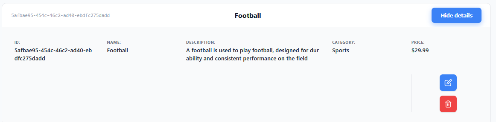
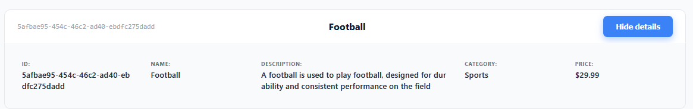

# Product Management System

This project is a web application for managing a product catalog, developed as a recruitment task. It features a Spring Boot backend, an Angular frontend, and a Cassandra database.

## 1. Tech Stack

The application utilizes a modern tech stack to ensure security, scalability, and maintainability:

* **Backend**: Spring Boot 3.5.13, Java 21
* **Database**: Apache Cassandra 5.0.8
* **Frontend**: Angular
* **Security**: Spring Security (OAuth2 JWT, CSRF)
* **Validation**: Jakarta Validation
* **Infrastructure**: Docker, Docker Compose
* **CI/CD**: GitHub Actions
* **Testing**: JUnit 5, MockMvc, Testcontainers

## 2. Documentation

### API Endpoints
The following table summarizes the available REST API endpoints for product management:

| Method     | Endpoint                            | Description                             |
|:-----------|:------------------------------------|:----------------------------------------|
| **POST**   | `/api/products`                     | Add a new product                       |
| **GET**    | `/api/products`                     | Retrieve the full list of products      |
| **GET**    | `/api/products/{id}`                | Retrieve details for a specific product |
| **PUT**    | `/api/products/{id}`                | Update an existing product              |
| **DELETE** | `/api/products/{id}`                | Remove a product from the system        |
| **GET**    | `/api/products/category/{category}` | Filter products by their category       |

### Interactive API Documentation
The project includes **Swagger UI**, which provides an interactive interface to explore and test the API endpoints:
* **Swagger UI:** `/api/swagger-ui.html`

### Security and Roles
* **Authorized Access**: Every request to the API (excluding registration and login) must be authorized.
* **Role-Based Access Control**:
    * **USER**: Authorized to browse products and view details.
    * **ADMIN**: Authorized for full management operations, including adding, editing, and deleting products.

### Testing Strategy
The system's reliability is verified through several testing layers:
* **Unit Tests**: Verification of API responses and data validation.
* **Security Tests**: Ensuring correct endpoint permissions based on user roles.
* **Integration Tests**: Performed using an embedded database or Testcontainers.

##  3. How to Install

To build and run this application, you must have **Docker** and **Docker Compose** installed.

### Installation Steps
1.  **Clone the repository**:
    ```bash
    git clone https://github.com/WiktorGruszczynski/softwaremind-recruitment-task.git
    cd softwaremind-recruitment-task
    ```

2. Environment Configuration
   The application requires administrative credentials for the initial setup. You can configure these using the following methods:
   
   * **`.env` File (Recommended):** Create a `.env` file in the root directory and define the variables there. This is the most secure method to keep sensitive data out of your version control system.

   ---
   
   ### Configuration Variables
   
   | Variable           | Description                                              |
   |:-------------------|:---------------------------------------------------------|
   | **ADMIN_EMAIL**    | The email address for the default administrator account. |
   | **ADMIN_PASSWORD** | The password for the default administrator account.      |
   

3.  **Launch via Docker Compose**:
    Run the following command to build and start the database, backend, and frontend services:
    ```bash
    docker compose up --build
    ```

4.  **Accessing the Services**:
    * **Frontend UI**: Open your browser at `http://localhost:4200`.
    * **Backend API**: Accessible at `http://localhost:8080/api`.
    * **Cassandra Database**: The database service is available on port `9042`.

---

## 4. Preview

### Products catalog

**Admin view**

The administrator interface displays full product details alongside action buttons for hiding details, editing information, and deleting the entry



**User view**

The standard user interface shows the same product specifications but restricts the available actions to only hiding or showing the details



